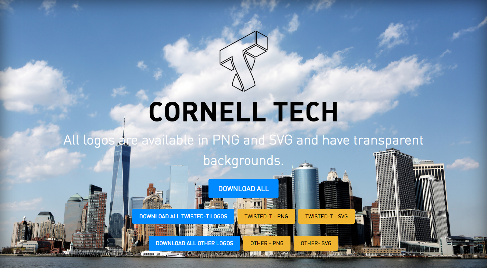

# Cornell Tech Logos

  

## Check it out at [`fvcproductions.github.io/cornell-tech-logos`](http://fvcproductions.github.io/cornell-tech-logos)!

All the Cornell Tech logos in one place.

## Downloading

All logos are available in PNG and SVG and have transparent backgrounds.

## Contributing

> To get started...

- 🍴 Fork this repo [here](https://github.com/fvcproductions/readme#fork-destination-box)
- 🔨 Hack away
- 😊 Add yourself as a contributor
- 🔧 Make a pull request [here](https://github.com/fvcproductions/cornell-tech-logos/compare)

> Or just create an issue - any little bit of help counts! 😊

- 😯 Create an issue [here](https://github.com/fvcproductions/cornell-tech-logos/issues)!

## Credits

 |
:---:|
[`fvcproductions`](http://fvcproductions.com) |

## License

2016 © [FVCproductions](http://fvcproductions.com) & [Cornell Tech](http://tech.cornell.edu)

## Donations

> Feed me... 🍕

